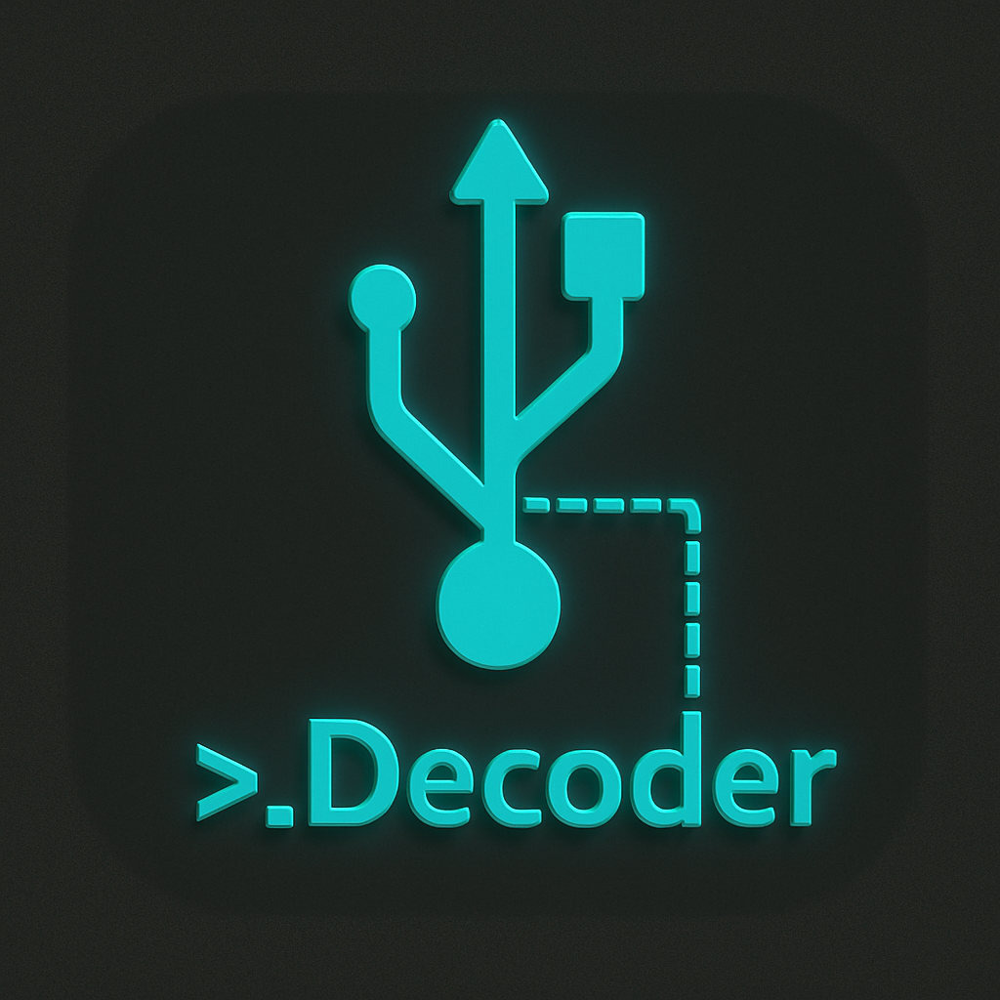

<p align="center">
  
</p>

# USB Decoder

**USB Decoder** is a cross-platform GUI application for converting USB protocol payloads into human-readable formats. Ideal for reverse-engineering and hardware hacking, it supports:

- **Device Descriptors** (18‑byte standard USB headers)
- **Configuration Descriptors** (9+ bytes)
- **String Descriptors** (UTF‑16LE Unicode strings)
- **Interface Descriptors**
- **Endpoint Descriptors**
- **HID Reports** (raw input/output reports)
- **Hex Dumps** (formatted hex strings)
- **Raw Bytes** (unparsed byte arrays)

---

## 🚀 Quickstart

```bash
# 1) Clone the repository and enter
git clone https://github.com/fuhaku/USBdecoder-app.git
cd USBdecoder-app

# 2) Make helper scripts executable
ochmod +x setup.sh build-gui-app.sh

# 3) Bootstrap, build, and package in one go
./setup.sh

# 4) Launch the packaged app
enjoy open "dist/USB Decoder.app"
```

> This single command sequence will:
> 1. Create a Python 3.12 (or fallback) venv
> 2. Install PyQt6 & PyInstaller into that venv
> 3. Install `create-dmg` via Homebrew (if needed)
> 4. Build the macOS `.app` bundle and `.dmg` installer

---

## 📦 Requirements

- **Python 3.10+** (Tested on 3.11; packaging venv uses Python 3.12 if available)
- **Homebrew** (for installing `create-dmg`)
- **Git** (to clone the repo)

All Python dependencies installed via `setup.sh`:

- PyQt6 >= 6.9.0
- PyInstaller == 6.13.0

---

## 🛠️ How it works

- **`setup.sh`**:
  1. Picks `python3.12` (or `python3`) to create a `pkg-venv`
  2. Activates the venv and installs PyQt6 & PyInstaller
  3. Ensures `create-dmg` is installed via Homebrew
  4. Calls `build-gui-app.sh` to perform the packaging

- **`build-gui-app.sh`**:
  1. Activates the `pkg-venv` created by `setup.sh`
  2. Cleans previous build artifacts (`build`, `dist`, etc.)
  3. Locates the Qt **`platforms`** plugin directory under PyQt6
  4. Runs PyInstaller with flags to collect all PyQt6 submodules and include the Qt platform plugins
  5. Signs the resulting `.app` bundle
  6. Packages a `.dmg` installer via `create-dmg`

---

## ▶️ Running without Packaging

If you’d like to run directly from source for rapid iteration:

```bash
source pkg-venv/bin/activate
python USBdecoder-native.py
```

---

## 📂 Repository Contents

```text
USBdecoder-native.py      # Main PyQt6 application
setup.sh                  # Bootstraps packaging environment + calls build script
build-gui-app.sh          # Builds .app + .dmg using PyInstaller
usb_re_icon.icns          # Custom neon-retro icon
requirements.txt          # Minimal pip requirements (PyQt6)
README.md                 # This documentation
``` 

---

## ⚖️ License

This project is released under the **MIT License**. See [LICENSE](LICENSE) for details.
